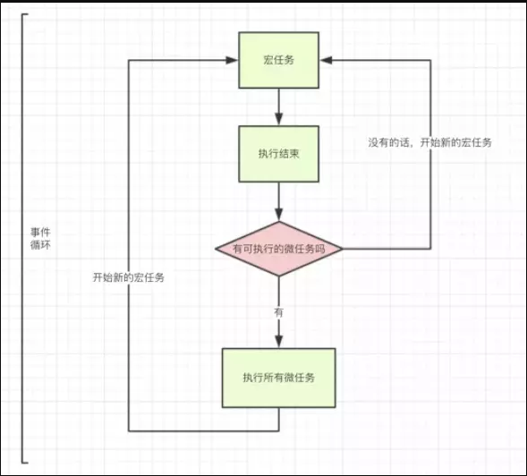

# 浅谈js事件机制(event loop)
### 为什么js是单线程？
js作为主要运行在浏览器的脚本语言，js主要用途之一是操作DOM。

在js高程中举过一个栗子，如果js同时有两个线程，同时对同一个dom进行操作，这时浏览器应该听哪个线程的，如何判断优先级？

为了避免这种问题，js必须是一门单线程语言，并且在未来这个特点也不会改变。

### 执行栈与任务队列
因为js是单线程语言，当遇到异步任务时，不可能一直等待异步完成，再继续往下执行，在这期间浏览器是空闲状态，很明显这会导致巨大的资源浪费。

* 执行栈

当执行某个函数、用户点击一次鼠标，Ajax完成，一个图片加载完成等事件发生时，只要指定过回调函数，这些事件发生时就会进入执行栈队列中，等待主线程读取,遵循先进先出原则
* 主线程

主线程循环：即主线程会不停的从执行栈中读取事件，会执行完所有栈中的同步代码。

当遇到一个异步事件后，并不会一直等待异步事件返回结果，而是会将这个事件挂在与执行栈不同的队列中，我们称之为任务队列(Task Queue)。

然后当主线程将执行栈中所有的代码执行完之后，主线程将会去查看任务队列是否有任务。如果有，那么主线程会依次执行那些任务队列中的任务。

以下看个demo:
```
let a = () => {
  setTimeout(() => {
    console.log('任务队列函数1')
  }, 0)
  for (let i = 0; i < 5000; i++) {
    console.log('a的for循环')
  }
  console.log('a事件执行完')
}
let b = () => {
  setTimeout(() => {
    console.log('任务队列函数2')
  }, 0)
  for (let i = 0; i < 5000; i++) {
    console.log('b的for循环')
  }
  console.log('b事件执行完')
}
let c = () => {
  setTimeout(() => {
    console.log('任务队列函数3')
  }, 0)
  for (let i = 0; i < 5000; i++) {
    console.log('c的for循环')
  }
  console.log('c事件执行完')
}
a();
b();
c();
```
以上代码执行之后打出日志的顺序是 'a的for循环', 'a事件执行完','b的for循环', 'b事件执行完','c的for循环', 'c事件执行完', '任务队列函数1','任务队列函数2','任务队列函数3'

### 异步执行的运行机制
- 所有任务都在主线程上执行，形成一个执行栈（execution context stack）。
- 主线程之外，还存在一个”任务队列”（task queue）。系统把异步任务放到”任务队列”之中，然后继续执行后续的任务。
- 一旦”执行栈”中的所有任务执行完毕，系统就会读取”任务队列”。如果这个时候，异步任务已经结束了等待状态，就会从”任务队列”进入执行栈，恢复执行。
- 主线程不断重复上面的第三步。

### 宏任务与微任务:
异步任务分为 宏任务（macrotask） 与 微任务 (microtask)，不同的API注册的任务会依次进入自身对应的队列中，然后等待 Event Loop 将它们依次压入执行栈中执行。

宏任务(macrotask)：script(整体代码)、setTimeout、setInterval、UI 渲染、 I/O、postMessage、 MessageChannel、setImmediate(Node.js 环境)

微任务(microtask)：Promise、 MutaionObserver、process.nextTick(Node.js环境）

### Event Loop(事件循环)：
Event Loop(事件循环)中，每一次循环称为 tick, 每一次tick的任务如下：

- 执行栈选择最先进入队列的宏任务(通常是script整体代码)，如果有则执行
- 检查是否存在 Microtask，如果存在则不停的执行，直至清空 microtask 队列
- 更新render(每一次事件循环，浏览器都可能会去更新渲染)
- 重复以上步骤



整体就是： 宏任务 > 所有微任务 > 宏任务

总结一下：
将所有任务看成两个队列：执行队列与事件队列。

执行队列是同步的，事件队列是异步的，宏任务放入事件列表，微任务放入执行队列之后，事件队列之前。

当执行完同步代码之后，就会执行位于执行列表之后的微任务，然后再执行事件列表中的宏任务

最后看一道面试题
```
   // 执行顺序问题，考察频率挺高的，先自己想答案**
    setTimeout(function () {
        console.log(1);
    });
    new Promise(function(resolve,reject){
        console.log(2)
        resolve(3)
    }).then(function(val){
        console.log(val);
    })
    console.log(4);
```
大家觉得这个代码执行后输出的顺序是什么样的？


